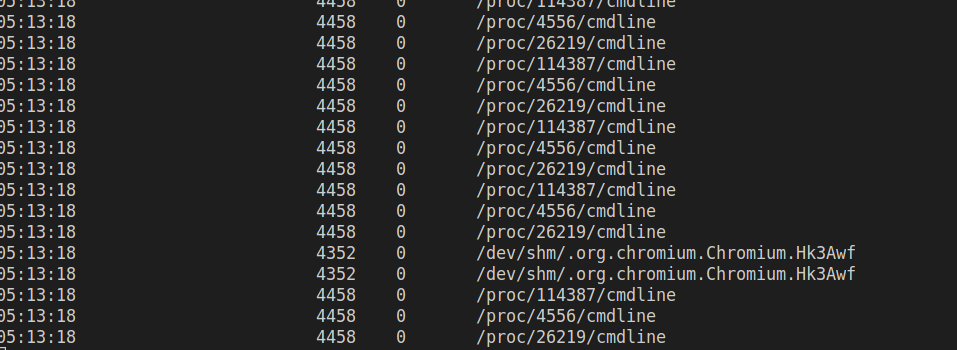

# Eunomia: 让 ebpf 程序的分发和使用像网页和 web 服务一样自然

> 我们的项目地址：https://github.com/yunwei37/Eunomia

eBPF 是一项革命性的技术，它能在操作系统内核中运行沙箱程序。被用于安全并有效地扩展内核的能力而无需修改内核代码或者加载内核模块。

但是开发、构建和分发 eBPF 一直以来都是一个高门槛的工作，社区先后推出了 BCC、BPFTrace 等前端绑定工作，大大降低了编写和使用 eBPF 技术的门槛，但是这些工具的源码交付方式，需要运行 eBPF 程序的 Linux 系统上安装配套的编译环境，对于分发带来了不少的麻烦，同时将内核适配的问题在运行时才能验证，也不利于提前发现和解决问题。

近年来，为解决不同内核版本中 eBPF 程序的分发和运行问题，社区基于 BTF 技术推出了 CO-RE 功能（“一次编译，到处运行”），一定程度上实现了通过 eBPF 二进制字节码分发，同时也解决了运行在不同内核上的移植问题，但是对于如何打包和分发 eBPF 二进制代码还未有统一简洁的方式。除了 eBPF 程序，目前我们还需要编写用于加载 eBPF 程序和用于读取 eBPF 程序产生数据的各种代码，这往往涉及到通过源码复制粘贴来解决部分问题。

Eunomia 同样基于 CO-RE（Compile Once-Run Everywhere）为基础实现，保留了资源占用低、可移植性强等优点，同时更适合在生产环境批量部署所开发的应用:

Eunomia 想要探索一条全新的路线：在本地编译或者远程服务器编译之后，使用 http RESTful API 直接进行 ebpf 字节码的分发，在生产环境最小仅需 4 MB 的运行时，约 100ms 的时间和微不足道的内存、CPU 占用即可实现 ebpf 代码动态分发、热加载、热更新，不受内核版本限制，不需要在生产环境中安装底层库（如 LLVM、python 等）、搭建环境即可启动；

<!-- TOC -->

- [ebpf：一个革命性的技术](#ebpf一个革命性的技术)
- [ebpf 开发和分发方式](#ebpf-开发和分发方式)
- [Eunomia: 我们的探索](#eunomia-我们的探索)
  - [快速开始](#快速开始)
    - [下载安装](#下载安装)
    - [run!](#run)
  - [代码：](#代码)
- [What's the next?](#whats-the-next)
- [Eunomia：我们的三个初衷](#eunomia我们的三个初衷)
- [参考资料](#参考资料)

<!-- /TOC -->

## ebpf：一个革命性的技术

从古至今，由于内核有监视和控制整个系统的特权，操作系统一直都是实现可观察性、安全性和网络功能的理想场所。同时，操作系统内核也很难进化，因为它的核心角色以及对稳定和安全的高度要求,因此，操作系统级别的创新相比操作系统之外实现的功能较少。


eBPF 从根本上改变了这个定律。通过允许在操作系统内运行沙箱程序，应用开发者能够运行 eBPF 程序在运行时为操作系统增加额外的功能。然后操作系统保证安全和执行效率，就像借助即时编译器（JIT compiler）和验证引擎在本地编译那样。这引发了一波基于 eBPF 的项目，涵盖了一系列广泛的使用案例，例如：

- 在现代数据中心和云原生环境中提供高性能网络和负载均衡；
- 以低开销提取细粒度的安全可观察性数据；
- 帮助应用开发者追踪应用程序；
- 洞悉性能问题和加强容器运行时的安全性

## ebpf 开发和分发方式

众所周知，计算机程序的分发也经历了几个阶段，每个阶段都会带来一次巨大的流量突破和爆发：

1. 使用机器码或汇编编写，和当前机器的架构强绑定，没有移植性可言；
2. 在这之后，伟大的先驱们开发了各种计算机高级编程语言（如 C )和编译器，此时移植需要针对特定的机器指令集架构，有一个编译器实现，并且在移植的时候通过编译器进行源代码的再次编译；
3. 使用虚拟机进行分发和运行（例如 Java），可以预先编译好程序并进行分发，在特定的机器上使用虚拟机进行解译和运行，将编译阶段和运行阶段解耦；
4. 在浏览器中直接浏览 web 网页或使用 web 应用程序，仅仅需要一条 url 链接或者说一些 web 请求，就能在随时随地打开并且运行对应的应用程序，获得相似的体验，不再受设备和操作系统的限制（能打败你的只有网速！）；

同样， ebpf 程序的开发和分发也经历了以下几个阶段：

5. 类似 linux 内核源代码的 samples/bpf 目录下的 eBPF 示例，开发一个匹配当前内核版本的 eBPF 程序，并编译为字节码（或者直接手写字节码），再分发到生产环境中，和当前内核版本强绑定，几乎没有可移植性，开发效率也很低：

```c
int main(int ac, char **argv)
{
    struct bpf_object *obj;
    struct bpf_program *prog;
    int map_fd, prog_fd;
    char filename[256];
    int i, sock, err;
    FILE *f;

    snprintf(filename, sizeof(filename), "%s_kern.o", argv[0]);

    obj = bpf_object__open_file(filename, NULL);
    if (libbpf_get_error(obj))
        return 1;

    prog = bpf_object__next_program(obj, NULL);
    bpf_program__set_type(prog, BPF_PROG_TYPE_SOCKET_FILTER);

    err = bpf_object__load(obj);
    if (err)
        return 1;

    prog_fd = bpf_program__fd(prog);
    map_fd = bpf_object__find_map_fd_by_name(obj, "my_map");
    ...
 }
```

6. 基于 BCC、bpftrace 的开发和分发，一般来说需要把 BCC 和开发工具都安装到容器中，开发效率高、可移植性好，并且支持动态修改内核部分代码，非常灵活。但存在部署依赖 Clang/LLVM 等库，每次运行都要执行 Clang/LLVM 编译，严重消耗 CPU、内存等资源，容易与其它服务争抢的问题；

```python
# initialize BPF
b = BPF(text=bpf_text)
if args.ipv4:
    b.attach_kprobe(event="tcp_v4_connect", fn_name="trace_connect_v4_entry")
    b.attach_kretprobe(event="tcp_v4_connect", fn_name="trace_connect_v4_return")
b.attach_kprobe(event="tcp_close", fn_name="trace_close_entry")
b.attach_kretprobe(event="inet_csk_accept", fn_name="trace_accept_return")

```

7. 基于 libbpf 的 CO-RE（Compile Once-Run Everywhere）技术实现，只要内核已经支持了 BPF 类型格式，就可以使用从内核源码中抽离出来的 libbpf 进行开发，这样可以借助 BTF 获得更好的移植性，但这样依旧需要使用已经编译好的二进制或者 .o 文件进行分发，也需要编写不少辅助函数解决加载 ebpf 程序的问题，分发和开发效率较低；

```c
#include "solisten.skel.h"
...
int main(int argc, char **argv)
{
    ...
    libbpf_set_strict_mode(LIBBPF_STRICT_ALL);
    libbpf_set_print(libbpf_print_fn);

    obj = solisten_bpf__open();
    obj->rodata->target_pid = target_pid;
    err = solisten_bpf__load(obj);
    err = solisten_bpf__attach(obj);
    pb = perf_buffer__new(bpf_map__fd(obj->maps.events), PERF_BUFFER_PAGES,
                  handle_event, handle_lost_events, NULL, NULL);
    ...
}
```

基于 libbpf ，也有其他项目做出了尝试，例如 coolbpf 项目利用远程编译的思想，把用户的 BPF 程序推送到远端的服务器并返回给用户.o 或.so，提供高级语言如 Python/Rust/Go/C 等进行加载，然后在全量内核版本安全运行；BumbleBee 自动生成与 eBPF 程序相关的用户空间的代码功能，包括加载 eBPF 程序和将 eBPF 程序的数据作为日志、指标和直方图进行展示；但相对而言，使用和分发都还不是很便捷。

## Eunomia: 我们的探索

我们希望能做到：

- 通过 RESTful API，就能以极低的成本分发和部署 eBPF 程序，不需要暂停跟踪、重启；

或者更进一步，只需要复制粘贴以下这段：

```json
'{"data":"f0VMRgIBAQAAAAAAAAAAAAEA9wABAAAAAAAAAAAAAAAAAAAAAAAAANAIAAAAAAAAAAAAAEAA\nAAAAAEAADQAMAL8WAAAAAAAAhQAAAA4AAAC/CAAAAAAAABgBAAAAAAAAAAAAAAAAAAC3AgAA\nqAAAALcDAAAAAAAAhQAAAIMAAAC/BwAAAAAAABUHCQAAAAAAY4cAAAAAAAB5YxAAAAAAAL9x\nAAAAAAAABwEAACgAAAC3AgAAfwAAAIUAAAAtAAAAv3EAAAAAAAC3AgAAAAAAAIUAAACEAAAA\ntwAAAAAAAACVAAAAAAAAAER1YWwgQlNEL0dQTAAAAAAAAAAAAAAAAAAAAAAAAAAAn+sBABgA\nAAAAAAAAGAIAABgCAABjAgAAAAAAAAIAAAQQAAAAAQAAAAIAAAAAAAAABgAAAAYAAABAAAAA\nAAAAAAAAAAIEAAAAEgAAAAAAAAEEAAAAIAAAAQAAAAAAAAADAAAAAAMAAAAFAAAAGwAAABYA\nAAAAAAABBAAAACAAAAAAAAAAAAAAAgcAAAAAAAAAAAAAAwAAAAADAAAABQAAAAAABAAqAAAA\nAAAADgEAAAABAAAAAAAAAAAAAAIKAAAALQAAAAQAAARAAAAARwAAAAsAAAAAAAAASwAAAA4A\nAABAAAAATgAAABAAAACAAAAAUwAAABIAAAAAAgAAWgAAAAQAAAQIAAAAAQAAAAwAAAAAAAAA\nZgAAAA0AAAAQAAAAbAAAAA0AAAAYAAAAegAAAAMAAAAgAAAAfgAAAAAAAAECAAAAEAAAAI0A\nAAAAAAABAQAAAAgAAACbAAAAAAAAAQgAAABAAAABpAAAAAAAAAEIAAAAQAAAAAAAAAAAAAAD\nAAAAAA8AAAAFAAAABgAAALYAAAAAAAABAQAAAAgAAAEAAAAAAAAAAwAAAAARAAAABQAAAAAA\nAAAAAAAAAQAADQMAAAC7AAAACQAAAL8AAAABAAAMEwAAAAAAAAAAAAADAAAAABEAAAAFAAAA\nDQAAAE0CAAAAAAAOFQAAAAEAAABVAgAAAQAADwAAAAAIAAAAAAAAABAAAABbAgAAAQAADwAA\nAAAWAAAAAAAAAA0AAAAAdHlwZQBtYXhfZW50cmllcwBpbnQAX19BUlJBWV9TSVpFX1RZUEVf\nXwByYgB0cmFjZV9ldmVudF9yYXdfc3lzX2VudGVyAGVudABpZABhcmdzAF9fZGF0YQB0cmFj\nZV9lbnRyeQBmbGFncwBwcmVlbXB0X2NvdW50AHBpZAB1bnNpZ25lZCBzaG9ydAB1bnNpZ25l\nZCBjaGFyAGxvbmcgaW50AGxvbmcgdW5zaWduZWQgaW50AGNoYXIAY3R4AGhhbmRsZV9leGVj\nAHRyYWNlcG9pbnQvc3lzY2FsbHMvc3lzX2VudGVyX29wZW4AL2hvbWUveXVud2VpL2NvZGlu\nZy9saWJicGYtYm9vdHN0cmFwL2JwZnRvb2xzL2NsaWVudC10ZW1wbGF0ZS9jbGllbnQuYnBm\nLmMAaW50IGhhbmRsZV9leGVjKHN0cnVjdCB0cmFjZV9ldmVudF9yYXdfc3lzX2VudGVyKiBj\ndHgpAAl1NjQgaWQgPSBicGZfZ2V0X2N1cnJlbnRfcGlkX3RnaWQoKTsACWUgPSBicGZfcmlu\nZ2J1Zl9yZXNlcnZlKCZyYiwgc2l6ZW9mKCplKSwgMCk7AAlpZiAoIWUpAAllLT5waWQgPSBw\naWQ7ADA6MjowAAlicGZfcHJvYmVfcmVhZF9zdHIoJmUtPmZpbGVuYW1lLCBzaXplb2YoZS0+\nZmlsZW5hbWUpLCAodm9pZCAqKWN0eC0+YXJnc1swXSk7AAlicGZfcmluZ2J1Zl9zdWJtaXQo\nZSwgMCk7AH0ATElDRU5TRQAubWFwcwBsaWNlbnNlAJ/rAQAgAAAAAAAAABQAAAAUAAAArAAA\nAMAAAAAcAAAACAAAAMsAAAABAAAAAAAAABQAAAAQAAAAywAAAAoAAAAAAAAA7gAAADkBAAAA\nSAAACAAAAO4AAABwAQAAC1AAABgAAADuAAAAlgEAAAZkAABIAAAA7gAAAMQBAAAGaAAAUAAA\nAO4AAADNAQAACXAAAFgAAADuAAAA4gEAAEB0AABgAAAA7gAAAOIBAAAZdAAAcAAAAO4AAADi\nAQAAAnQAAIAAAADuAAAAMAIAAAJ8AACYAAAA7gAAAEsCAAABhAAAEAAAAMsAAAABAAAAWAAA\nAAoAAADcAQAAAAAAAAAAAAAAAAAAAAAAAAAAAAAAAAAAAAAAAABjAAAABADx/wAAAAAAAAAA\nAAAAAAAAAACUAAAAAAACAJgAAAAAAAAAAAAAAAAAAAAAAAAAAwACAAAAAAAAAAAAAAAAAAAA\nAACMAAAAEQADAAAAAAAAAAAADQAAAAAAAABXAAAAEgACAAAAAAAAAAAAqAAAAAAAAABwAAAA\nEQAEAAAAAAAAAAAAEAAAAAAAAAAYAAAAAAAAAAEAAAAGAAAAEAIAAAAAAAAAAAAABgAAACgC\nAAAAAAAAAAAAAAQAAAAsAAAAAAAAAAAAAAADAAAAQAAAAAAAAAAAAAAAAwAAAFAAAAAAAAAA\nAAAAAAMAAABgAAAAAAAAAAAAAAADAAAAcAAAAAAAAAAAAAAAAwAAAIAAAAAAAAAAAAAAAAMA\nAACQAAAAAAAAAAAAAAADAAAAoAAAAAAAAAAAAAAAAwAAALAAAAAAAAAAAAAAAAMAAADAAAAA\nAAAAAAAAAAADAAAA0AAAAAAAAAAAAAAAAwAAAOwAAAAAAAAAAAAAAAMAAAA2NTcALnRleHQA\nLnJlbC5CVEYuZXh0AC5tYXBzAC5yZWx0cmFjZXBvaW50L3N5c2NhbGxzL3N5c19lbnRlcl9v\ncGVuAC5sbHZtX2FkZHJzaWcAbGljZW5zZQBoYW5kbGVfZXhlYwBjbGllbnQuYnBmLmMAcmIA\nLnN0cnRhYgAuc3ltdGFiAC5yZWwuQlRGAExJQ0VOU0UATEJCMF8yAAAAAAAAAAAAAAAAAAAA\nAAAAAAAAAAAAAAAAAAAAAAAAAAAAAAAAAAAAAAAAAAAAAAAAAAAAAAAAAAAAAAAAAAAAAAEA\nAAABAAAABgAAAAAAAAAAAAAAAAAAAEAAAAAAAAAAAAAAAAAAAAAAAAAAAAAAAAQAAAAAAAAA\nAAAAAAAAAAAeAAAAAQAAAAYAAAAAAAAAAAAAAAAAAABAAAAAAAAAAKgAAAAAAAAAAAAAAAAA\nAAAIAAAAAAAAAAAAAAAAAAAATwAAAAEAAAADAAAAAAAAAAAAAAAAAAAA6AAAAAAAAAANAAAA\nAAAAAAAAAAAAAAAAAQAAAAAAAAAAAAAAAAAAABQAAAABAAAAAwAAAAAAAAAAAAAAAAAAAPgA\nAAAAAAAAEAAAAAAAAAAAAAAAAAAAAAgAAAAAAAAAAAAAAAAAAACHAAAAAQAAAAAAAAAAAAAA\nAAAAAAAAAAAIAQAAAAAAAJMEAAAAAAAAAAAAAAAAAAABAAAAAAAAAAAAAAAAAAAACwAAAAEA\nAAAAAAAAAAAAAAAAAAAAAAAAmwUAAAAAAAD8AAAAAAAAAAAAAAAAAAAAAQAAAAAAAAAAAAAA\nAAAAAHsAAAACAAAAAAAAAAAAAAAAAAAAAAAAAJgGAAAAAAAAqAAAAAAAAAAMAAAABAAAAAgA\nAAAAAAAAGAAAAAAAAAAaAAAACQAAAAAAAAAAAAAAAAAAAAAAAABABwAAAAAAABAAAAAAAAAA\nBwAAAAIAAAAIAAAAAAAAABAAAAAAAAAAgwAAAAkAAAAAAAAAAAAAAAAAAAAAAAAAUAcAAAAA\nAAAgAAAAAAAAAAcAAAAFAAAACAAAAAAAAAAQAAAAAAAAAAcAAAAJAAAAAAAAAAAAAAAAAAAA\nAAAAAHAHAAAAAAAAwAAAAAAAAAAHAAAABgAAAAgAAAAAAAAAEAAAAAAAAABBAAAAA0z/bwAA\nAIAAAAAAAAAAAAAAAAAwCAAAAAAAAAMAAAAAAAAAAAAAAAAAAAABAAAAAAAAAAAAAAAAAAAA\ncwAAAAMAAAAAAAAAAAAAAAAAAAAAAAAAMwgAAAAAAACbAAAAAAAAAAAAAAAAAAAAAQAAAAAA\nAAAAAAAAAAAAAA==\n","data_sz":3088,"maps":["rb"],"name":"","progs":["handle_exec"]}'
```

它就是一个已经编译好的 CO-RE ebpf 程序，接入 `tracepoint/syscalls/sys_enter_open` 跟踪点，可以观测到所有 open 系统调用文件打开的事件，并且输出它的文件路径、进程的 pid（目前还没有进行压缩，压缩后可以更短）；

- 通过 RESTful API，把 ebpf 程序类似于 web 服务一样发布，一键完成配置、启动和停止；
- 只需要一个小的运行时就能启动，也可以嵌入到其他应用中，类似 lua 虚拟机一样提供附加的 ebpf 追踪服务；

对比 BCC 等工具：不存在部署依赖 Clang/LLVM 等库和 每次运行都要执行 Clang/LLVM 编译，严重消耗 CPU、内存等资源等问题；对比于传统的通过镜像分发或通过二进制分发 CO-RE 程序：分发速度和启动速度极快：不需要启动容器、容器调度；不需要进行停机更新和重启，不需要其他的辅助工具、函数或脚本，也不需要任何其他语言的编译运行时环境；

### 快速开始

只需要三个步骤就能完成完整的热更新操作：

1. 在本地通过 eunomia 给定的 ebpf 程序脚手架进行编译，生成对应 ebpf 程序的 字节码；
2. Client 通过 http API 将编译完成的 ebpf 字节码、和对应的元信息直接推送给 eunomia 运行时；
3. Eunomia 运行时直接使用编译好的 ebpf 程序热更新注入内核；

目前版本是这三个步骤，如果结合远程编译的工具，如 coolbpf，我们也许可以本地只需要点击按钮或者在网页上编写 ebpf 程序，然后一键点击就能完成热更新；

#### 下载安装

可以通过这里下载编译完成的二进制：

https://github.com/yunwei37/Eunomia/releases/

我们目前在 ubuntu、fedora 等系统和 5.13、5.15、5.19 等内核版本上进行过测试，需要正确运行的话，应该需要内核的编译选项开启：

```conf
CONFIG_DEBUG_INFO_BTF=y
```

在旧的内核版本上，可能需要额外安装 BTF 文件信息。

我们提供了一个小的 client example，用来测试使用：

https://github.com/yunwei37/Eunomia/tree/master/bpftools/client-template

```bash
├── client.bpf.c
├── client.cpp
├── client.example1.bpf.c
├── client.example2.bpf.c
├── client.h
├── Makefile
└── Readme.md
```

只需要执行：

```bash
git clone https://github.com/yunwei37/Eunomia
git submodule update --init --recursive
cd bpftools/client-template
make
```

即可生成 client 二进制文件。

#### run!

最简单的启动方式（用来测试），把我上面贴的那段 json 复制一下（注意头尾的单引号），放在最后面作为参数，然后就能跑起来啦：

```bash
sudo ./eunomia run hotupdate [json data]
```

现在我们看看如何使用 http RESTful API：通过以下命令即可启动 Eunomia server：

```bash
$ sudo ./eunomia server

start server mode...
[2022-08-18 05:09:32.540] [info] start eunomia...
[2022-08-18 05:09:32.540] [info] start safe module...
[2022-08-18 05:09:32.543] [info] start container manager...
[2022-08-18 05:09:32.895] [info] OS container info: Ubuntu 20.04.4 LTS
[2022-08-18 05:09:33.534] [info] start ebpf tracker...
[2022-08-18 05:09:33.535] [info] process tracker is starting...
```

server 默认监听本地的 8527 地址。使用 client 即可远程分发并启动一个跟踪器：

```bash
$ ./client start
200 :["status","ok","id",3]
```

server 会启动一个 ebpf 追踪器，跟踪所有的 open 系统调用，并输出它的文件路径、进程的 pid；



使用 list 就能查看所有的已经在运行的检查器：

```bash
$ ./client list
200 :["status","ok","list",[[1,"process"],[2,"files"],[3,"tcpconnect"],[4,"hotupdate"]]]
```

把刚刚启动的那个检查器停下来：

```bash
$ ./client stop 4
200 :["status","ok"]
```

server 端就会收到信号并且停止当前在运行的 id 为 4 的 ebpf 程序：

```bash
[2022-08-18 05:24:18.830] [info] accept http request to stop tracker
[2022-08-18 05:24:18.831] [info] waiting for the tracker to cleanup...
[2022-08-18 05:24:18.879] [info] updatable tracker exited.
[2022-08-18 05:24:19.832] [info] exit!
```

我们提供了三个示例：

- bpftools/client-template/client.bpf.c: 文件打开
- bpftools/client-template/client.example1.bpf.c: 进程启动
- bpftools/client-template/client.example2.bpf.c: 进程停止

现在直接把 client.example1.bpf.c 的内容复制到 client.bpf.c 中，然后 make 重新编译，不需要停下 server，再重新发起请求：

```bash
$ ./client start
200 :["status","ok","id",4]
```

就可以看到，eunomia server 已经在进行进程启动的追踪，输出 pid、ppid、进程可执行文件路径等信息：


> 我们目前还在测试阶段，API 还未完善，可能有所疏漏，也还会有不少的变化和更新）

### 代码：

https://github.com/yunwei37/Eunomia/blob/master/bpftools/client-template/client.bpf.c

ebpf 的代码和正常的 libbpf 追踪器代码没有什么不同：

```c
#include "vmlinux.h"
#include <bpf/bpf_helpers.h>
#include <bpf/bpf_tracing.h>
#include <bpf/bpf_core_read.h>
#include "client.h"

char LICENSE[] SEC("license") = "Dual BSD/GPL";

struct {
	__uint(type, BPF_MAP_TYPE_RINGBUF);
	__uint(max_entries, 256 * 1024);
} rb SEC(".maps");

SEC("tracepoint/syscalls/sys_enter_open")
int handle_exec(struct trace_event_raw_sys_enter* ctx)
{
	u64 id = bpf_get_current_pid_tgid();

	u32 pid = id;
	struct event *e;
	/* reserve sample from BPF ringbuf */
	e = bpf_ringbuf_reserve(&rb, sizeof(*e), 0);
	if (!e)
		return 0;
	e->pid = pid;
	bpf_probe_read_str(&e->filename, sizeof(e->filename), (void *)ctx->args[0]);
	/* successfully submit it to user-space for post-processing */
	bpf_ringbuf_submit(e, 0);
	return 0;
}
```

https://github.com/yunwei37/Eunomia/blob/master/bpftools/client-template/client.cpp

client 的代码也非常简单（~70行） ，我们只需要看这个部分，它将 ebpf 程序和元信息解析编码后生成了 json 请求，并且通过网络发送：

```c
  if (client_bpf__create_skeleton(&obj))
  {
    return 1;
  }
  std::string harg = bpf_skeleton_encode(obj.skeleton);
  json http_data = json::parse(
      "{\
            \"name\": \"hotupdate\",\
            \"export_handlers\": [\
                {\
                    \"name\": \"plain_text\",\
                    \"args\": []\
                }\
            ],\
            \"args\": [\
            ]\
        }");
  http_data["args"].push_back(harg);
  auto req = cli.Post("/start", http_data.dump(), "text/plain");
```

在 https://github.com/yunwei37/Eunomia/blob/master/bpftools/hot-update/update_tracker.h 中，我们有一个预先加载好的模板进行解析，并交由 libbpf 进行重定位和 ebpf 热加载：

```c
  /* Load and verify BPF application */
  struct ebpf_update_meta_data ebpf_data;
  ebpf_data.from_json_str(json_str);
  skel = single_prog_update_bpf__decode_open(ebpf_data);
  if (!skel)
  {
    fprintf(stderr, "Failed to open and load BPF skeleton\n");
    return 1;
  }

  /* Load & verify BPF programs */
  err = update_bpf__load(skel);
  ...
```

## What's the next?

目前的实现优势：

- 将 ebpf 程序的开发和部署运行解耦；
- 仅需网络的传输延时和 libbpf 重定位、内核验证即可启动 ebpf 程序；
- 通过 http RESTful 接口进行请求，便于插件和二次扩展；
- 仅需一个 eunomia runtime ，体积非常小，在新内核版本上不需要其他依赖；
- 可以更换内核跟踪点或 hook 函数；
- 和内核版本无关；

待改进：

- 目前还不能动态更改 ebpf progs 程序挂载点数量（还需要进一步对 libbpf codegen 进行深度改进），当前可以采用提供一些预编译模板的方式；
- 在开发时需要使用 libbpf-bootstrap 脚手架（可以通过远程编译进一步简化）
- 需要预先实现有用户态的 c 代码模板对 ebpf 程序的输出进行解析（可以通过使用 lua、python 等非预编译脚本语言，随请求发布进行解决）

也许在未来：

- ebpf 程序可以在网页上编译；
- 只需要安装一个小的运行时，或者在应用程序中嵌入一个小的模块（类似 lua 虚拟机一样），有一个通用的 API 接口，再加上一个插件应用商店或者市场，只需要在浏览器中点击一下链接，就能在本地启动一个 ebpf 应用，或者给一个现有的服务接入 ebpf 的超能力，不需要停机重启就能一键更换可观测性插件；
- 每个人都可以通过链接自由地分享自己写好的 ebpf 程序和编译好的 ebpf 代码，甚至可以通过聊天窗口直接发送编译好的程序代码，复制粘贴一下即可运行，不需要任何的编译依赖；

## Eunomia：我们的三个初衷

我们是一个来自浙江大学的学生团队，我们希望开发一个这样的产品：

1. 无需修改代码，无需繁琐的配置，仅需 BTF 和一个微小的二进制即可启动监控和获取 Eunomia 核心功能：

  > - 代码无侵入即可开箱即用收集多种指标，仅占用少量内存和 CPU 资源；
  > - 告别庞大的镜像和 BCC编译工具链，最小仅需约 4MB 即可在支持的内核上或容器中启动跟踪；

2. 让 ebpf 程序的分发和使用像网页和 web 服务一样自然：

  > - 数百个节点的集群难以分发和部署 ebpf 程序？bpftrace 脚本很方便，但是功能有限？Eunomia 支持通过 http RESTful API 直接进行本地编译后的 ebpf 代码的分发和热更新，仅需约一两百毫秒和几乎可以忽略的 CPU 内存占用即可完成复杂 ebpf 追踪器的部署和更新；
  > - 可以通过 http API 高效热插拔 ebpf 追踪器（约 100ms），实现按需追踪；

3. 提供一个新手友好的 ebpf 云原生监控框架：

  > - 最少仅需继承和修改三四十行代码，即可在 Eunomia 中基于 libbpf-bootstrap 脚手架添加自定义 ebpf 追踪器、匹配安全告警规则、获取容器元信息、导出数据至 prometheus 和 grafana，实现高效的时序数据存储和可视化，轻松体验云原生监控；
  > - 提供编译选项，作为一个 C++ 库进行分发；可以嵌入在其他项目中提供服务；
  > - 提供了丰富的文档和开发教程，力求降低 ebpf 程序的开发门槛；

我们的项目地址： https://github.com/yunwei37/Eunomia

我们的网站： https://yunwei37.github.io/Eunomia/

Eunomia 还在试验性质的阶段，目前支持的功能还很有限，敬请期待

## 参考资料

- https://jishuin.proginn.com/p/763bfbd73692
- https://www.cnblogs.com/davad/p/15891220.html
- https://www.infoq.cn/article/3lvxf3zcfy7fp2atq2zo
- https://www.infoq.cn/article/iielspcwjf6owd6jmbef